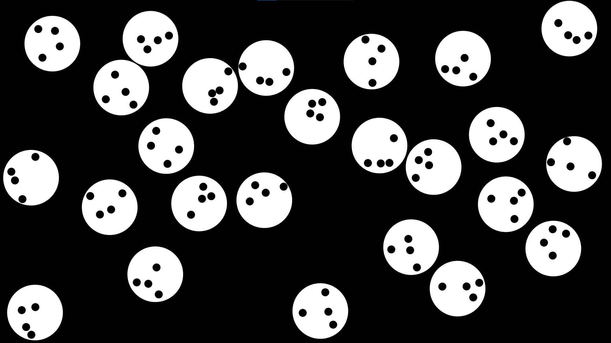

# Collosion-simulation

Two interation collosion simulation from scratch.
There are little black balls in the bigger white balls, the simulation strictly follows the laws of physics considering the black-black, the black-white, and the white-white collosions at the same time.

